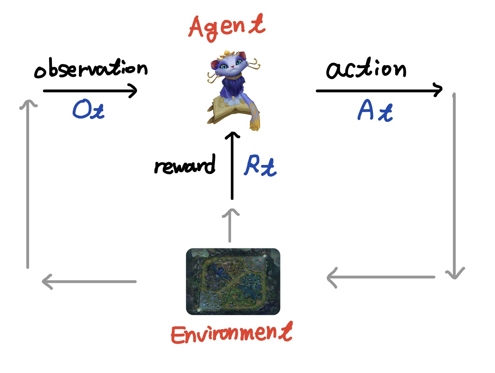

# Introduction to Reinforcement Learning

## About Reinforcement Learning

* 강화 학습은 다양한 Field\(Computer Science, Psycology, Economics, ...\)의 교집합이라 볼 수 있는 분야이다
* 일반적으로 Machine Learning은 지도학습\(Supervised Learning\), 비지도학습\(Unsupervised Learning\), 그리고 강화학습\(Reinforcement Learning\)으로 나눈다. 따라서 강화학습은 머신러닝의 세부 분야라고 볼 수 있다

### What makes Reinforcement Learning "Reinforcing"?

 강화 학습은 다음과 같은 점에서 다른 Machine Learning 분야에서 차이를 보인다.

* Supervisor가 없고, Reward Signal에 따라서 의사결정을 내린다
  * 지도 학습의 경우 우리가 원하는 결과를 함께 학습하는 경우가 있는데, RL은 그렇지 않고 Reward에 의존한다. 그런데 이 Reward의 경우에는 후술하겠지만 즉각적인 반응이 아니기에 순간 선택이 항상 최적이라는 보장이 없다.
* Feedback이 즉각적으로 이루어지지 않는다. \(not instantaneous → delayed!\)
* 시간의 흐름이 중요하다. 
  * Sequential한 데이터를 주로 다루며, 이는 non-iid이다.
* **Agent의 Action이 Subsequent data에 영향을 많이 끼친다.**

### Examples

* 주식 투자 프로그램 - 언제 사고 언제 팔지?
* 플러피 버드 게임 - 언제 점프를 해야 벽에 부딪히지 않을까?
* 전원 관리 프로그램 - 전력 임계점에 도달하지 않고 어떻게 전력 생산량을 maximize하지?
* ...

## Reinforcement Learning Problem

### Reward와 Agent

* Reward $$R_t$$: Sclar 데이터, Feedback Signal
  * Step $$t$$에 얼마나 Agent가 잘 하고 있는지 알려준다
* Agent의 역할 : reward의 총량을 극대화하기!

### Definition : Reward Hypothesis

* 모든 Goal은 **Maximisation of Expected Cumulative Reward**로 나타낼 수 있다!
  * 즉, 누적되는 보상의 기대치를 최대로 하는 것을 Goal로 삼을 수 있다!

### Example of Reward

* 포커게임
  * Positive reward - 게임에서 승리
  * Negative reward - 게임에서 패배
* 휴머노이드 걷기 알고리즘
  * Positive reward - 걷기 위한 모션에 성공
  * Negative reward - 걷다가 고꾸라짐
* ...

### Goal of RL

* 미래의 Reward의 총량을 극대화하는 행동\(Action\)을 선택하기
  * Action은 장기적인 결과를 지향해야 한다
  * Reward는 지연될 여지가 있다 
    * 지금 당장 손해봐도, 장기적인 관점에서 이득을 보는 경우가 있다.
    * ex\) 금융 투자 - 존버는 승리한다!

## Analysis of Situation with RL

### Agent and Environment \(in "Time Series"\)

**Agent** : 우리가 조절할 상호작용의 주체

**Environment** : Agent와 상호작용하는 주변 환경 

시간 $$t$$의 상황에서 Agent와 Environment는 다음과 같이 상호작용을 진행한다:

* Agent : $$A_t$$를 실행하고, $$O_t, R_t$$를 받는다
* Environment : $$A_t$$를 수용하고, $$O_t, R_t$$를 방출한다.

### History and State

**History** : Observation, Action, Reward 등의 시퀀스 → $$H_t = A_1, O_1, R_1, ... , A_t, O_t, R_t$$

* History에 기반한 다음에 벌어질 일은? : Agent는 Action을 택하고, Environment는 Observation과 Reward를 택한다.

**State** : 다음에 벌어질 일을 결정하는 정보 

* 일반적으로 State는 History에 대한 함수이다 → $$S_t = f(H_t)$$
* **Environment State**
  * $$S^{e}_{t}$$: 특정 Environment의 개인적인\(personal\) state
    * Agent에는 주로 알려져 있지 않고, 알려졌다고 해도 결정과 관련없는 정보일 가능성이 있음
* **Agent State**
  * \*\*\*\*$$S^a_t$$**:** Agent가 가지고 있는 state
    * Agent가 다음 Action을 선택하는 데에 사용한다 
    * RL Algorithm에는 이 정보를 사용한다.
    * $$S^a_t = f(H_t)$$

### Information State \(= Markov State\)

* History로부터 온 **모든 유용**한 정보 

### Definition : "Markov"

* State $$S_t$$가 Markov이 되기 위한 필요충분 조건은, $$P[S_{t+1}|S_t] = P[S_{t+1}|S_1, ... , S_t]$$이다.
  * 즉, 현재로부터 과거의 정보 $$S_1, ..., S_{t-1}$$은 미래에 일어날 일과 독립이다!
* State는 Future에 대한 **충분통계량**\(Sufficient Statistic\)이다.

## Environment with "Observability"

### Full Observable Environments\(전체 관측 환경\)

* Full Observability : Agent가 environment의 state를 직접적으로 관측 가능한 상황
  * $$O_t = S^a_t + s^e_t$$
  * Agent state = Environment state = Information state
* 일반적으로 이는 Markov Decision Process\(MDP\)를 따

### Partially Observable Environments\(부분 관측 환경\)

* Partial Observability : Agent가 environment의 state를 직접적으로 관찰할 수 없는 상황 
  * ex\) 포커 플레이 - 플레이어는 공개된 카드만 볼 수 있는 상황에서 선택을 해야 함 
  * Agent state ≠ Environment state
* 일반적으로 이는 Partially Observable Markov Decision Process\(POMDP\)를 따
  * Agent는 자신만의 State Representation $$S^a_t$$를 가져야 한다 
  * Examples:
    *  Complete history → $$S^a_t = H_t$$
    * "Belief" of environment state → $$S^a_t = (P[S^e_t = S^1], ... ,P[S^e_t = S^n])$$
    * Recurrent Neural Network → $$S^a_t = \sigma(s^a_{t-1}W_s + O_t W_o)$$ 

## Inside on RL Agent

* RL Agent는 다음 중 적어도 하나 이상은 포함해야 한다!
  * Policy - Agent의 행동 함수
  * Value Function - 각 State나 Action에 대한 가치 판단 함수 
  * Model - Environment에 대한 Agent의 생각/시선 

### Policy

* Agent의 행동
* State와 Action을 매핑 - $$a = \pi(s)$$
* cf\) Stochastic policy : $$\pi(a|s) = P[A=a|S=s]$$

### Value Function

* 미래의 Reward에 대한 Prediction
* State의 좋고 나쁨을 평가하기 위한 수단으로 사용
* $$V_{\pi}(s) = E_{\pi}[R_t + \gamma R_{t+1} + \gamma^2 R_{t+2} + ... | S_t = s]$$
  * 이때 $$\gamma$$는 1보다 작은 상수이며, 너무 먼 미래를 과도하게 반영하는 것을 막기 위함 

### Model

* Environment가 다음에 어떤 행동을 할 지 예측하는 녀석
* Transition : $$P^a_{ss'} = P[S'=s'|S=s, A=a]$$ \(State와 Action을 바탕으로 동적 State를 예측\)
* Rewards : $$R^a_s = E[R|S=s, A=a]$$ \(State와 Action을 바탕으로 다음 Reward 예측\)

### Categorizing RL Agents \(1\) - Value Function & Policy

* **Value Based**
  * Value Function + \(implicit or no policy\)
* **Policy Based**
  * Policy + \(no value function\)
* **Actor Critic**
  * Policy + Value Function

### Categorizing RL Agents \(2\) - Model 

* **Model-Free**
  * Policy and/or Value Function, no Model
* **Model-Based**
  * Policy and/or Value Function + Model

## Problem & Ways within RL

### 2 elementry problems in Sequential decision making

* Reinforcement Learning
  * Cold start : environment가 처음에 어떤지 잘 모른다
  * Agent가 직접 environment와 상호작용하면서 policy를 개선해 나가야한다.
* Planning
  * 알려진 environment에 대한 Model
  * Agent는 어떠한 외부의 추가 정보 없이 이 Model에 대해 연산을 수행함
* 결론 : RL과 Planning이 상호작용하면서 문제를 서로 극복할 수 있다.

### Exploration and Exploitation

* **Exploration** : RL에서 새로운 정보를 찾아내는 것 
* **Exploitation** : 기존에 있는 정보를  바탕으로 Reward를 극대화하는 것
* RL은 Trial-and-error를 바탕으로 한 학습 기법
  * Agent는 Environment으로부터의 경험으로부터 좋은 Policy를 찾아내야 한다.
  * 동시에 너무 많은 Reward를 잃어선 안 된다. \(Reward가 높으면 좋은데 너무 잃으면 곤란하니까\)
  * Exploration과 Exploitation을 적절히 잘 섞어서 진행하자.

### Prediction and Control

* Prediction
  * 주어진 Policy를 바탕으로 Future를 평가하는 것
* Control
  * Future를 최적화 하는 것, 가장 좋은 Policy를 찾아내는 

