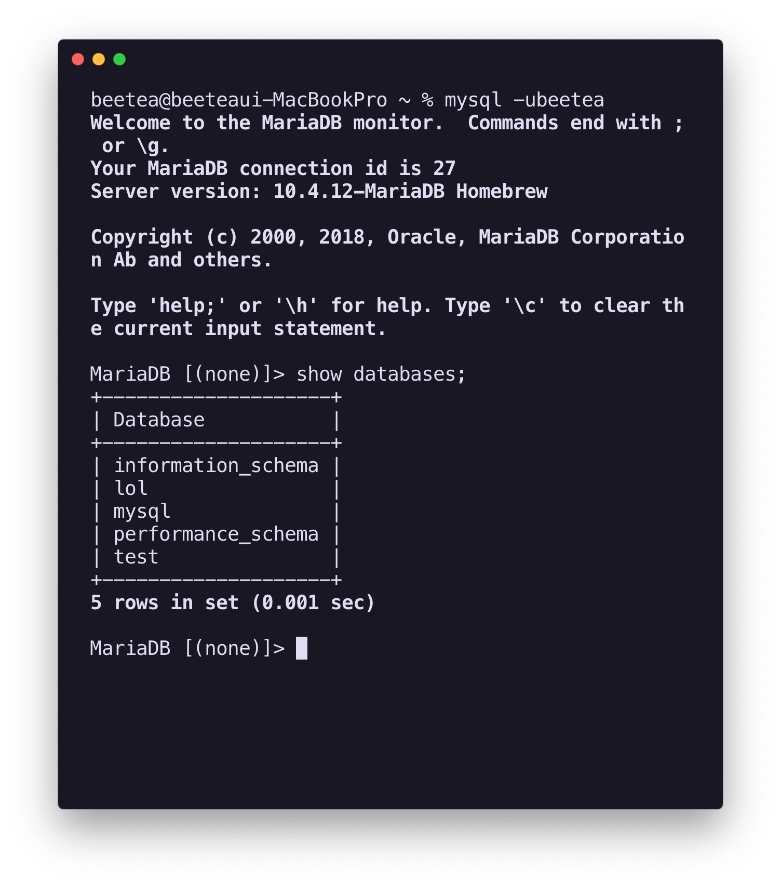
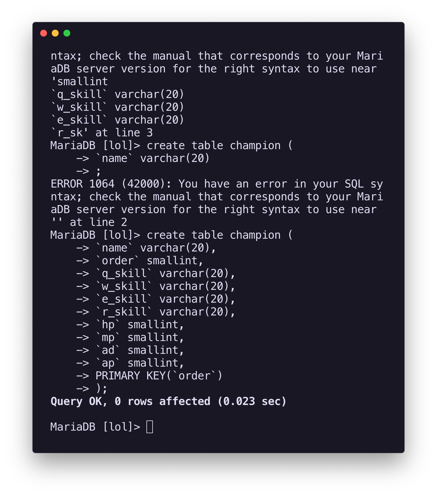
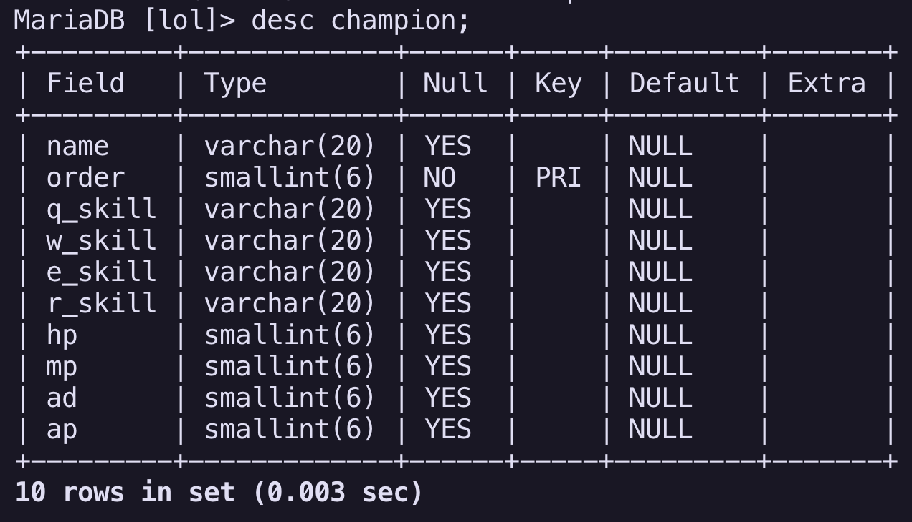
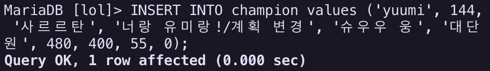
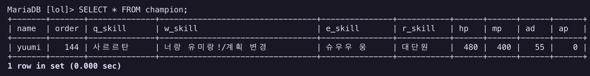

# mariaDB - Database와 Table

많은 시행착오 끝에 mariaDB를 설치하는 데에 성공하고, user를 등록한 후, 직접 DB를 다룰 수 있었다.


### 1. 데이터베이스 확인하기

```sql
SHOW databases; // SHOW : DB/Table을 보여주는 명
```



### 2. 데이터베이스 다루

```sql
CREATE DATABASE db_name; // 데이터베이스 생
DROP DATABASE db_name; // 데이터베이스 삭제
USE db_name; // 데이터베이스 지정
```

### 3. 테이블 만들기

```sql
CREATE TABLE tb_name (
    `col1` field1, // `column name` 필드속성,
    `col2` field2, 
    ...
); // 테이블 생성 -> 스키마를 생성

// cf) 스키마? - 데이터테이블에 들어가는 데이터의 
```



위 코드의 실행 결과는 다음 코드로 확인 가능:

```sql
desc tb_name;
```



### 4. 테이블에 데이터 추가하기

```sql
INSERT INTO tb_name values (col1, col2, ...);
```



### 5. 테이블에서 데이터 가져오

```sql
SELECT *cols FROM *tb_name;
```



올바르게 데이터가 잘 들어간 것을 확인할 수 있다! :\) 

