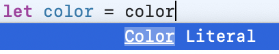
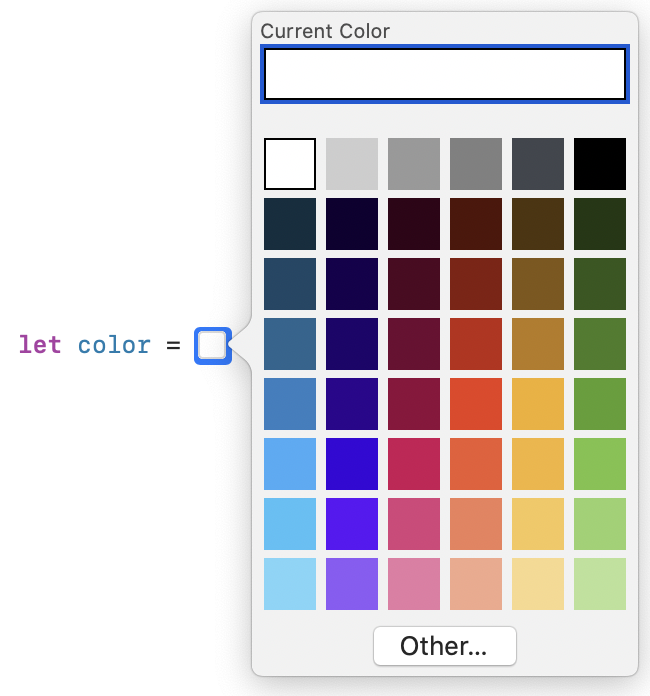
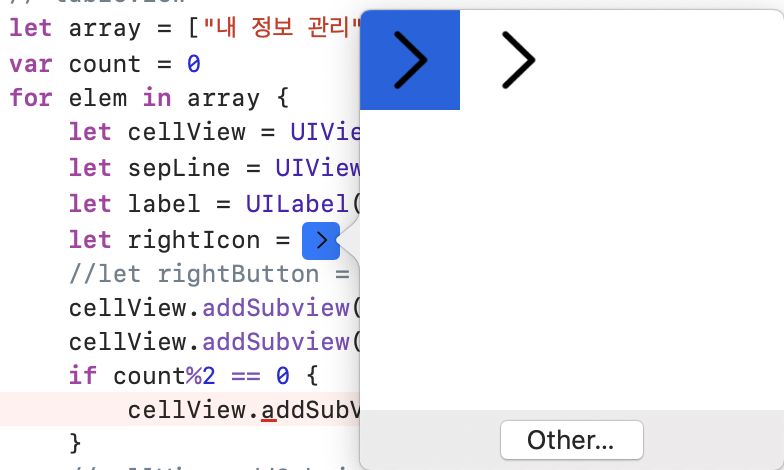

# Image Literal & Color Literal

### 개요 

 UIView와 UILabel의 Background에 색을 넣고 싶은 상황인데, 기존에 UIColor 등은 RGB를 0.0~1.0으로 Normalize한 값을 사용해서 여간 불편했다. :\(

그런데 역시 이를 대체할 수 있는 좋은 기능이 있었다! 바로 Color Literal과 Image Literal이다.

### Color Literal

평소 변수선언처럼 대입문을 작해주고 오른쪽에 대입할 녀석을 Color Literal으로 지정해주면:

이렇게 ColorPicker가 나오면서 쉽게 색을 고를 수 있다. 또한, 저 Other를 누르면 더 자세한 색 조정이 가능하며, 내가 Mac에서 가장 자주 쓰는 내장 기능 중 하나인 **색 추출 기능**도 사용할 수 있다. 짱!

### Image Literal

 Image Picker도 같은 원리이다. 일반적인 변수 선언을 진행해주고 오른쪽에 Image Literal을 작성하면 다음과 같은 ImagePicker Modal이 등장한다.

우리가 기존에 Asset으로 등록해놓았던 사진이나 Other...를 눌러서 다른 사진을 Import해올 수 있다. 여간 편리하지 않을 수 없다. :\)

