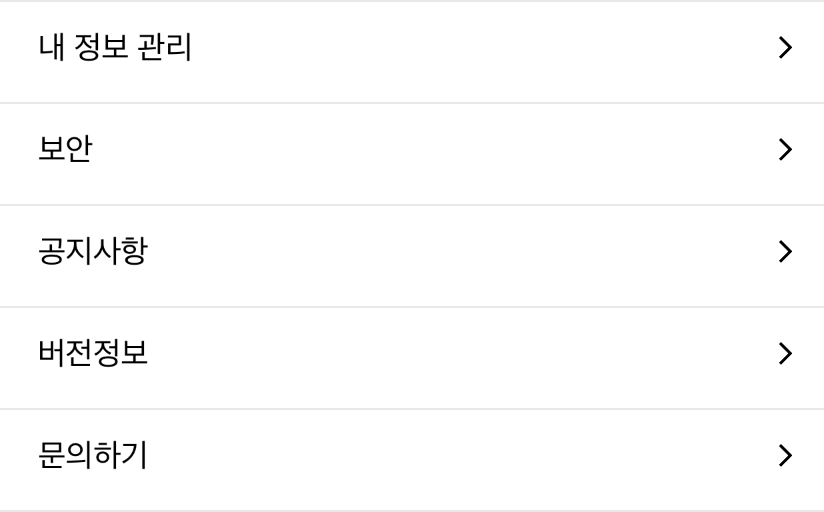

# UIStackView - 각 Cell 사이에 간격 넣기

### 문제 개요

* UIStackView의 각 cell 사이에 빈 칸을 두고 싶은 상황이였는데, 기존에는 background 색깔과 같은 UIView를 선언하고, height=1.0으로 주어 실선으로 구분하는 구조를 사용하였다.  
* 하지만 이보다는 **Cell 사이의 간격이 있다** 라는 표현이 더 좋을 것 같아 이를 변경하였다. 

### 해결하기 

* UIStackView의 Field 중에 `spacing` 요소를 사용해주면 쉽게 해결해줄 수 있다. 

```swift
// viewDidLoad() on UIViewController
stackView = UIStackView()
stackView.spacing = 1.0
```

* 이는 다음과 같이 UIStackView를 구성해준다.



* 이렇게 Cell을 구성하면 각 Cell 사이를 시각적으로 구분할 수 있어 시안성이 좋아지고 UX도 좋아진다. 문제 해결!

