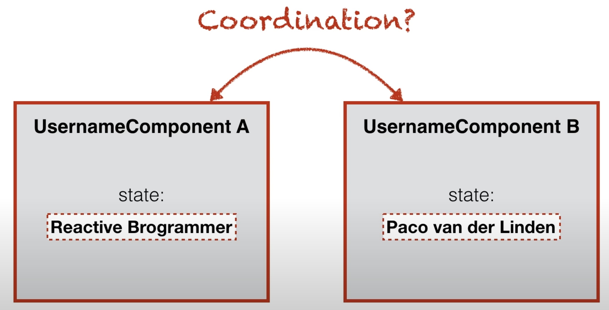
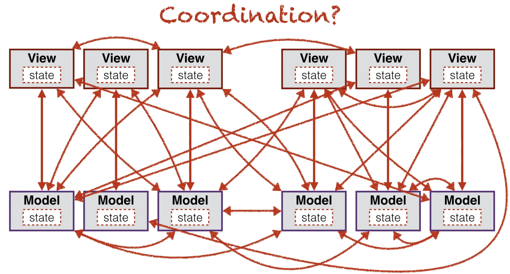
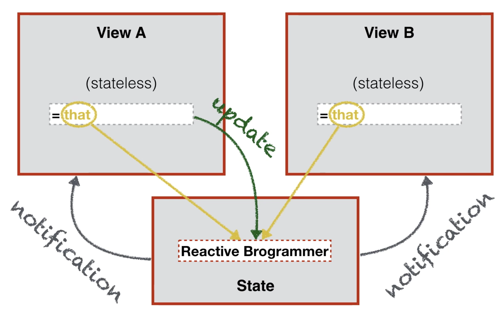
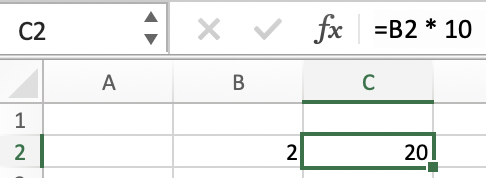

# Reactive Programming I - Beyond the Statement

### 들어가기 전

* Reactive Programming도 결국 OOP와 같은 Paradigm의 일종이다. 처음에 객체지향을 만나고 기겁을 했던 나 자신도 결국 어느정도 음미하며 즐기는 것처럼 RP도 꾸준히, 반복적으로 읽어가면서 음미하자 ☕️
* 단순히 이렇다 저렇다 하는 내용의 나열보다는 **왜 이렇게까지 해야하는지** 를 중점적으로 보자. 괜히 이렇게 쓰이는 것이 아니다. 💪
* [다음 강의](https://www.youtube.com/watch?v=Bme_RiT9CK4)를 기반으로 정리하였다. 이분 설명이 너무 기가맥힌데 왜 후속강의가 없는지 의아하다. Reactive Programming에 관한 기초정리가 잘 되어있으니 한번 보자 👀

### 어쩌다 여기까지?

Modern 어플리케이션 개발을 진행하다보면 많은 문제를 만나는데, 그 대표적인 2가지가 바로 다음과 같다. 

* Complex Statement\(복잡한 상\)
* Asynchronous\(비동기\)

이 두가지 중 Statement에 관한 이야기를 해보자.

### Complex Statement - OOP의 민낯


다음과 같은 **나사 빠진\(어딘가 오류가 있는\)** 트위터가 있다고 가정해보자. 페이스북도 비슷하지만 프로필에도 이름, 남기는 트윗\(게시물\)에도 이름이 나타난다. 만약 이 상황에서 이름을 바꾸면 어떻게 될까?


 다음과 같이 프로필 이름은 변경되었지만 트윗의 이름은 변경되지 않는 것을 확인 할 수 있다. \(물론 실제 프로덕트에서 이러면 큰일난다.\)  물론 새로고침을 진행하면 동일한 이름으로 변경되는데, **왜 이런 문제가 발생할 여지가 있을까?**



프로필을 관리하는 여러 Component가 있다고 했을 때, 이는 보통 **객체** 단위로 관리되고, 각 이름은 state로 관리된다. 그래서 보통 이름을 바꾸거나 하는 등의 Event가 발생하게 되면 이를 관리하기 위해 두 컴포넌트를 맞춰줄\(Coordinate\) 줄 필요가 있다. 



정말 많이 쓰이는 MVC 패턴 등에서는 이런 Model과 View와의 Coordination이 일어나는데, 문제는 이게 **엄청 많다**는 것이다. 그러다보니 Flow를 체크하기 어려워지고 디버깅이 어려워지게 된다. 그래서 사람들은 Reactive한 생각을 냈는데...





1. 제 3의 state 선언, 이곳에 state를 담아
2. 각 View의 state를 stateless - 특정한 값으로 못박아두는 것이 아닌, 포인터처럼 값을 가져오는 것 - 으로 선언
3. 한 View에서 이 state를 변경하려고 시도 → **state에 update\(\)**
4. 독립 state는 이 update 요청이 들어오면 자신의 값을 변경하고 자신을 가리키는\(구독하는\) **state에게 바뀌었다는 사실을 전달\(notification\)**

이런 점에서 반응형\(Reactive\)이라는 말이 붙지 않았을까 싶다.   


### Automatically derived state - Excel의 Spreadsheet func처럼!

```python
a = 10
b = a * 20

a = 20
print(b)
```

명령형 프로그래밍 패러다임에서 다음 코드의 출력 결과는 무엇일까? 당연하게도 **200**이다. \(b는 2번째 줄에서 정의되었으므로\)

그런데 C Language부터 배운 나에겐 이게 당연했는데, 갑자기 그런 생각이 들었다. **b를 a와의 관계로 만드는 것은 안 되나?** 가령 a를 20으로 바꾸면 b는 자연스럽게 400이 되는 것처럼 말이다!



우리는 사실 이런 테크닉을 이미 여러 번 써봤을텐데, 바로 엑셀에서 함수를 사용할 때이다. C2셀에 넣은 저 식처럼 관계식을 만들어두면 B2의 값이 바뀌면 C2의 값이 바뀌는 상황 말이다. 상황에 따라 이런 **관계를 통한 자동 업데이트**가 필요할 때가 있다. 이쯤만 봐도 Reactive Programming의 장점이 확 보이기 시작한다!

